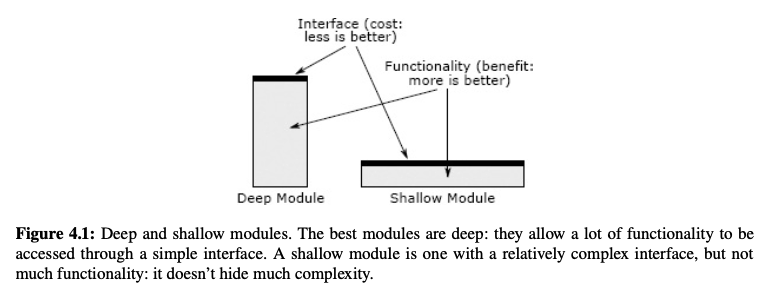

+ An abstraction is a simplified view of an entity, which omits unimportant details.
+ Abstractions are useful because they make it easier for us to think about and manipulate complex things.

+ In the definition of abstraction, the word “unimportant” is crucial.
+ The more unimportant details that are omitted from an abstraction, the better.

+ An abstraction can go wrong in two ways.
    1. it can include details that are not really important
        + when this happens, it makes the abstraction more complicated than necessary, which increases the cognitive load on developers using the abstraction.
    2. when an abstraction omits details that really are important
        + This results in obscurity: developers looking only at the abstraction will not have all the information they need to use the abstraction correctly.
        + An abstraction that omits important details is a false abstraction: it might appear simple, but in reality it isn't.

+ **The key to designing abstractions is to understand what is important, and to look for designs that minimize the amount of information that is important.**

+ Deep modules
    + The best modules are those that provide powerful functionality yet have simple interfaces.
    + I use the term deep to describe such modules.
    + 

+ good examples of deep modules
    + unix I/O(has five interfaces: open/read/write/lseek/close)
    + language garbage collector(has no interface at all; it works invisibly behind the scenes to reclaim unused memory)

+ deep modules such as Unix I/O and garbage collectors provide powerful abstractions because:
    + they are easy to use
    + yet they hide significant implementation complexity

+ ch4.5
    + Red Flag: Shallow Module

+ Classitis: 类要小，方法要小，但是也不能走到极端
    + The conventional wisdom in programming is that classes should be small, not deep. Students are often taught that the most important thing in class design is to break up larger classes into smaller ones.
    + The extreme of the “classes should be small” approach is a syndrome I call classitis, which stems from the mistaken view that “classes are good, so more classes are better.”

+ **Providing choice is good, but interfaces should be designed to make the common case as simple as possible**

