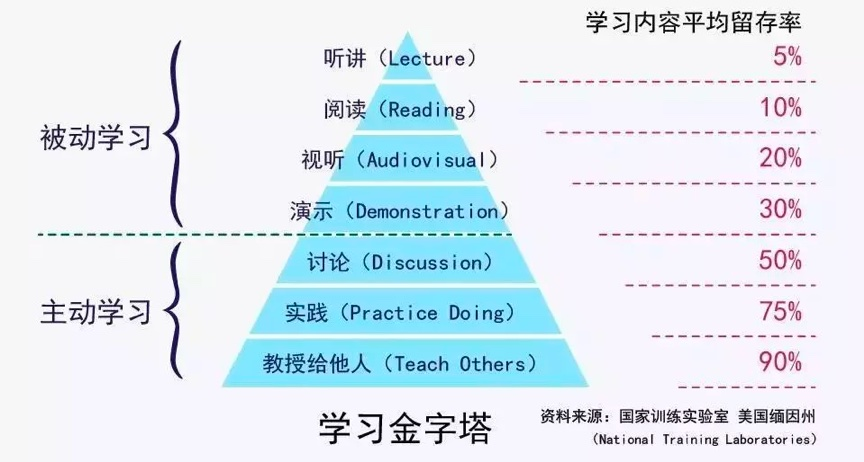

### [极客时间: 左耳听风-业精于勤, 行成于思](https://time.geekbang.org/column/article/41118)

再次强调一下，这个世界上的学习只有两种，一种是被动学习，一种是主动学习。听课，看书，看视频，看别人的演讲，这些统统都是被动学习，知识的留存度最多只有 30%，不信你问问自己，今天我的专栏中，你记住了多少？而与别人讨论，实践和传授给别人，是主动学习，其可以让你掌握知识的 50% 到 90% 以上。

+ 这也是为什么我在我的读者群中推荐出 ARTS 的任务
    + 每个人每周一个 Algorithm
    + Review 一篇英文文章
    + 总结一个工作中的技术 Tip
    + Share 一个传递价值观的东西

我希望这个事可以给大家得到相应的算法、代码、技术和影响力的训练。如果你不去践行，那么我专栏上的这些东西你也就只是看看罢了

不要说，某某技术因为太复杂了所以是“反人类的”，那些“硬核技术”不是反人类的，是“反低能人类”的。所以，别把自己归到那个类别中。

**要学会不断地挑战自己，挑战自己就是不让自己舒舒服服地像个僵尸一样地活着，而是改变自己让自己像凤凰一样在浴火中涅槃重生！**

