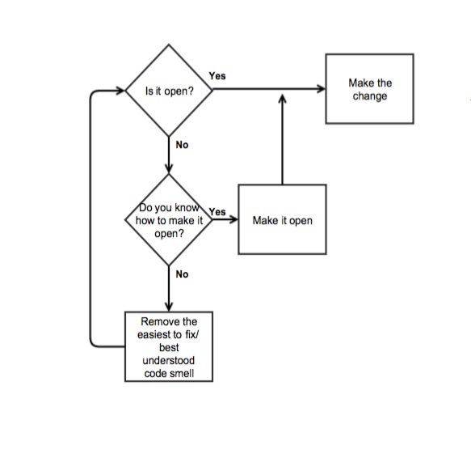

+ The decision about whether to refactor in the first place should be determined by whether your code is already "open" to the new requirement.

决定是否需要重构代码前, 需要先确定你的代码是否支持 对新需求进行扩展

+ "Open" is short for "Open/Closed," which in turn is short for "open for extension and closed for modification."

Open 是 开闭原则的简写, 表示代码要对扩展开放, 对修改关闭

+ Code is open to a new requirement when you can meet that new requirement without changing existing code.

即: 代码写好以后, 为适应新的需求, 应该尽量少去考虑修改原有代码, 而应考虑去扩展原有代码

## SOLID

+ S - Single Responsibility

The methods in a class should be cohesive(有凝聚力的) around a single purpose.

一个类中的方法应该只做一件事, 并把它做好

+ O - Open-Closed

Objects should be open for extension, but closed for modification.

类的实例应该对扩展开放, 对修改关闭

+ L - Liskov Substitution

Subclasses should be substitutable for their superclasses.

子类应该能替代它的父类

+ I - Interface Segregation

Objects should not be forced to depend on methods they don’t use.

接口隔离原则, 类的实例不应该依赖那些它不使用的方法

+ D - Dependency Inversion

Depend on abstractions, not on concretions.

依赖倒置原则: 程序应该依赖于抽象接口, 不应该依赖于具体实现方式

A.高层次的模块不应该依赖于低层次的模块, 他们都应该依赖于抽象
B.抽象不应该依赖于具体, 具体应该依赖于抽象

+ The "open" principle says that you should not conflate the process of moving code around, of refactoring, with the act of adding new features.

"Open"原则是说, 你不应该同时 修改代码/重构 和 添加新功能

+ You should instead separate these two operations. When faced with a new requirement, first rearrange the existing code such that it’s open to the new feature, and once that’s complete, then add the new code.

这些事应该分开来做

当有新需求时, 应该先重组当前的代码, 使得当前的代码对于新需求所需的扩展"开放"

当重组完成以后, 再去添加新的代码, 实现新的功能

+ The current Bottles class is not open to the "6-packs" requirement because adding new verse variants requires editing the conditional.

当前Bottles类是没法直接为新需求进行扩展, 因为为了满足新需求, 需要修改当前的条件判断分支

+ Therefore, when faced with this new requirement, your first task is to refactor the existing code into a shape such that you can then implement the new requirement by merely adding code.

遇到这中新需求时, 第一个任务应该是重构已有的代码, 让它能够适应"开闭原则" --- 不修改已有的代码, 仅通过向已有代码里增加代码就能满足需求

话虽如此(Yes), 但是如何达到这种效果确实需要认真学习的(But How?!)

+ When faced with this situation, be guided by the following flowchart.

当不知道该怎么做时, 参照下面的流程图 一步步接近目标

+ As per the above flowchart, first ask yourself if the existing code is already open to the new requirement. If so, your job is simply to write the new code.

"当前代码是否符合了开闭原则?"

+ Ask if you know how to alter the existing code to make it open to the new requirement.

"你知道怎么把代码变得对扩展开放吗?"

+ However, the sad truth is that the answer to both of those questions is often "no."
+ The existing code isn’t open to the new requirement, and you have no idea how to make it so.

通常来说, 这两个答案都是否定的

此时代码不对扩展开放, 也不知道该怎么修改代码, 让他变得开放

+ At this point "code smells" come to the rescue. If you can identify smells in code, you isolate flaws and correct them one by one.

这时候, 需要关注代码的坏味道(Code Smells)

如果你能识别出这些code smells, 你就能一个个把他们处理掉(利用APM/Sonar等工具)

