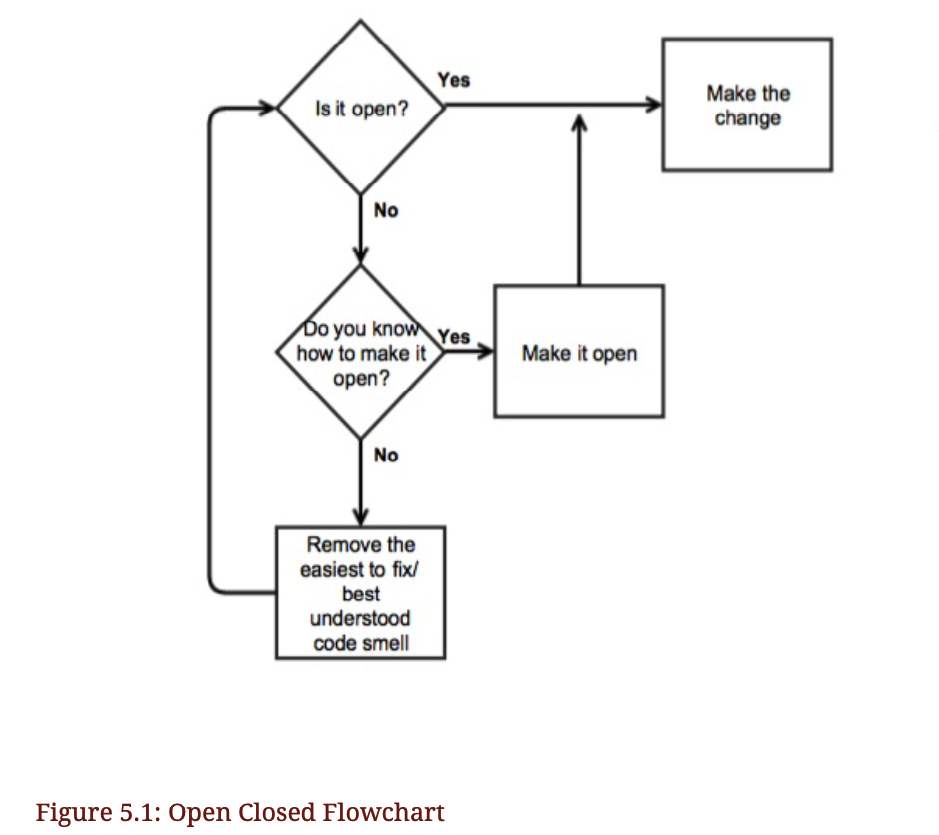

+ Code should be open for extension and closed for modification.




+  If anything, the current incarnation is less amenable to this requirement than was Shameless Green.

当前代码虽然已经移除了一些code smell, 从代码中提取出了一些隐含的概念, 但是还不是符合开闭原则的代码

+ The truth about refactoring is that it sometimes makes things worse, in which case your efforts serve gallantly to disprove an idea.

关于重构的事实是: 重构有可能使得现状变得更糟

+ The refactoring recipes don’t promise to result in code that better expresses the problem— they merely make it easy to create that new expression, and just as easy to revert it.

重构不能保证最终的代码表达能力更强, 能更好的描述问题

重构仅能使得代码更易于添加代码和回滚代码变更

+ Proper refactoring allows you to explore a problem domain safely.

正确的重构能让你对问题的探索变得容易和安全

+ You’ve now completed one refactoring, and the resulting code is not yet open to the six-pack requirement.

+ The current code, although not open to the new requirement, is improved.

当前代码虽然还没有符合开闭原则, 但是毫无疑问代码质量已经有了提升

+ Therefore, have faith, and iterate. This means you must continue to be guided by code smells, and doing so requires that you identify the smells in the current code.

所以打起精神来, 对代码进行迭代吧

这意味着你必须持续的消除代码里的code smell, 通过这种方式优化代码, 迭代地对代码进行重构

## 5.1.1. Identifying Patterns in Code

+ One way to get better at identifying smells is to practice describing the characteristics of code.

一个练习识别code smell的方法是: 多去练习描述某段代码的特征

+ The following questions draw attention to a number of interesting characteristics of the code as it’s written so far:

这几个问题能引发你对代码几个有趣的特点的思考

1. Do any methods have the same shape ?

这些方法的结构一样吗?

2. Do any methods take anargument of the same name ?

这些方法接收的参数名一样吗

3. Do arguments of the same name always mean the same thing ?

方法的参数名一样的时候, 他们的含义相同吗

4. If you were to add the private keyword to this class, where would it go ?

TODO ???

5. If you were going to break this class into two pieces, where’s the dividing line ?

如果你要把这段代码拆分为两部分, 怎么来分隔呢?

+ For those methods created by the Flocking Rules ( container , quantity , action , pronoun and successor , hereafter referred to as the "flocked five"):

对于那些通过应用"Flocking Rules"法则提取出的方法

6. Do the tests in the conditionals have anything in common?

条件句中的测试有什么共同点吗？(???)

7. How many branches do the conditionals have?

条件中有多少分支?

8. Do the methods contain any code other than the conditional?

方法中除了条件以外, 还有其他代码吗

9. Does each method depend more on the argument that got passed, or on the class as a whole?

这些方法更依赖与传入的参数还是更依赖于这整个类(整体)

+ The remainder of this section examines the above questions. If any didn’t occur to you, look back at the code and try to answer them before proceeding.

把这些问题当做"checklist", 思考时先试着回答这些问题

## 5.1.2. Spotting Common Qualities

+ Various Conditional Forms

```ruby
# verbose conditional
def container(number)
  if number == 1
    "bottle"
  else
    "bottles"
  end
end

# guard clause
def quantity(number)
  return "no more" if number == 0
  return number.to_s
end

# ternary expression
def pronoun(number)
  number == 1 ? "it" : "one"
end
```

+ This unnecessary variation makes the methods appear to be different when they are actually very much the same.

不必要的变体使得方法的结构看起来好像不一样(实际上是类似的)

+ Programmers naturally assume that difference exists for a reason, but here there isn’t one.

程序员一般会认为差异存在是有原因的, 但是并没有(TODO 这句话是指 这种具体的实现里没有, 还是说普遍都没有呢?)

+ Superfluous difference raises the cost of reading code, and increases the difficulty of future refactorings.

多余的差异会增加读代码的成本, 并会增加重构的难度


