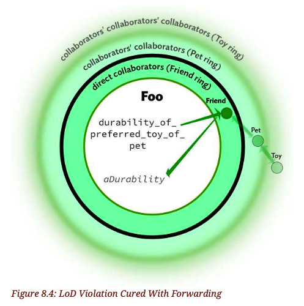
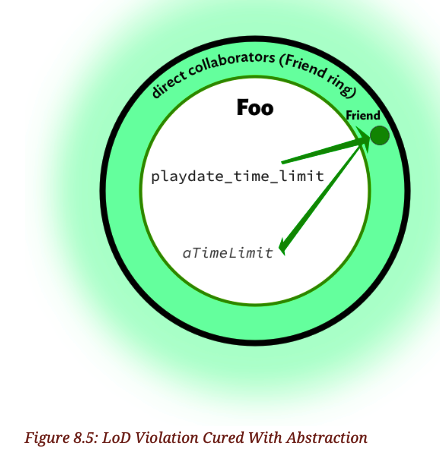

# 8.6. Obeying the Law of Demeter

+ Lines that contain many dots might violate the Law of Demeter (LoD).
+ This section defines that law, determines where it applies, explores the consequences of ignoring it, and explains how to fix violations.

## 8.6.1. Understanding the Law

+ Listing 8.19: Verse Method Contains Many Dependencies
```ruby
class Bottles
  # ...
  def verse(number)
    verse_template.new(number).lyrics
  end
end
```

+ the verse method knows:
    + that verse_template responds to new
    + that new expects an argument
    + that the argument to new must be a number
    + that the object returned from new(number) responds to the message lyrics that lyrics returns the actual lyrics of interest

+ **This list enumerates many things that Bottles knows about but doesn’t control, which means they’re dependencies**
+ Dependencies are vulnerabilities

依赖 是 脆弱性的来源

+ Dependencies can’t be avoided but should certainly be minimized.

应用程序无法避免依赖, 但是 应该尽量减少依赖

+ Be alert for superfluous dependencies and remove them with extreme prejudice.

警惕多余的依赖, 并以极端偏见消除它们

+ [Law of Demeter](https://en.wikipedia.org/wiki/Law_of_Demeter) (TODO unclear)
    + In its general form, the LoD is a specific case of loose coupling.
    +
    + Each unit should have only limited knowledge about other units: only units "closely" related to the current unit.
    + Each unit should only talk to its friends; don't talk to strangers.
    + Only talk to your immediate friends.

迪米特法则, 是松耦合的一种特例

```ruby
class Foo
  def durability_of_preferred_toy_of_best_friends_pet
    best_friend.pet.preferred_toy.durability
  end
end
```


`Foo` 首先将 `pet`消息发送给了 `best_friend`, 因为Foo知道 `best_firedn` 的存在, 所以`Friend`是直接的协作者, 发送消息后, 返回了一个`Pet`的实例

目前为止没问题

接下来, `Foo`给`pet`实例发送了`preferred_toy`消息, 注意: `Pet` 不是`Foo`的直接协作者

`Pet`是`Friend`的直接协作者

它的意思是: `Foo`依赖了`Friend`的直接协作者, 依赖了自己协作者的协作者

接下来这个过程又重复了一次: `Foo`给`Toy`的实例发送了`durability`消息, 发送这条消息, 要求`Foo`了解`Toy`的api, 即 `Foo`依赖了`Pet`的直接协作者, 依赖了自己协作者的协作者的协作者

+ The underlying code looks innocuous but the diagram makes it inescapably obvious that you can’t have a Foo unless you can provide it with a Friend who has a Pet who has a Toy.

代码看起来无害, 但图表表明, 除非你能把Foo提供给一个有宠物和玩具的朋友, 否则你不能拥有Foo(???)

+ The code may produce the correct output at this moment, but will not age well.

这段代码或许现在能正常工作, 但它的寿命注定不会长

+ This tight coupling across many objects introduces two serious problems which are then blithely lobbed into the future.

许多对象之间的这种紧密耦合引入了两个严重的问题, 这些问题如果不及时处理, 那么就是给未来埋坑

+ First, arranging the code in this way interferes with your ability to use Foo in new and unexpected contexts.

首先, 这种组织代码的方式 干扰你以后在其他地方使用`Foo`的能力

+ These consequences become obvious when you attempt to reuse Foo.

当你想要复用`Foo`的时候, 这些后果就会变得很明显

+ Tests serve many purposes, one of which is to reveal how easy it is to reuse code. Tightly-coupled code is difficult to test.

测试有很多目的, 其一就是揭示出复用这些代码的难度

紧密耦合的代码很难测试

+ Tightly-coupled objects require adding lots of context, all of which must be provided in order to run any test.

紧密耦合的代码需要增加很多的上下文, 这些上下文的存在是正常运行测试的必要条件

+ An object that’s hard to test is attempting to warn you that it will be difficult to reuse.

如果某个对象很难测试, 那么他也会很难以重用

+ Secondly, satisfying a requirement by chaining messages together allows you to make code work without figuring out what the objects actually want.

+ It’s time to have a look at the Demeter’s formal definition.

该仔细看看迪米特法则到底讲了什么了

+ The [Object-Oriented Programming: An Objective Sense of Style](https://www2.ccs.neu.edu/research/demeter/papers/law-of-demeter/oopsla88-law-of-demeter.pdf) whitepaper defines the law as follows:

+ For all classes C and for all methods M attatched to C, all objects to which M sends a message must be instances of classes associated with the following classes:
    1. The argument classes of M(including C)
    2. The instace variable classes of C
(Objects created by M, or by functions or methods which M calls, and objects in global variables are considered as arguments of M)

+ The above is a marvel of succinct precision but its very terseness makes it difficult to understand.

上面这句话简洁精确, 令人惊叹, 但它的简洁让人难以理解

+ The Law of Demeter says that from within a method, messages should be sent only to:
    + objects that are passed in as arguments to the method
    + objects that are directly available to self

迪米特法则指明, 在一个方法里, 消息之能发送给 作为这个方法的参数的对象; 或者 调用这个方法的实例(self)

```ruby
'AbCdE'.reverse.gsub(/C/, "!").downcase.chop # -> "ed!b"
```
The example above contains many dots but **is not a Demeter violation** because each intermediate message returns an object that conforms to the same API.

+ The Law of Demeter effectively restricts the list of other objects to which an object may send a message.

迪米特法则有效地限制了 其他对象发送的消息

+ Its purpose is to reduce the coupling between objects.

最终的目的是减少对象之间的耦合

+ From the message-senders point of view, an object may talk to its neighbors but not to its neighbor’s neighbors.

从消息发送者的角度看, 一个对象应该和他的"邻居"(直接相关的对象)沟通, 不该和他"邻居的邻居"沟通

+ Objects may only send messages to direct collaborators.

对象应该只给和他直接先关的对象发送消息

## 8.6.2. Curing Demeter Violations

+ One obvious way to cure message chains is by introducing message forwarding,[19] a technique often referred to in casual conversation as delegation.

一种明显的处理方法是: 引入方法转发

对上面的例子来说, 就是让Friend转发其他对象的方法

```ruby
class Friend
  def durability_of_preferred_toy_of_pet
    pet.durability_of_preferred_toy
  end
end

class Pet
  def durability_of_preferred_toy
    preferred_toy.durability
  end
end

class Toy
  def durability
    1.hour
  end
end

# Foo now only sends messages to best_friend
class Foo
  def durability_of_preferred_toy_of_best_friends_pet
    best_friend.durability_of_preferred_toy_of_pet
  end
end
```

+ The code in each method above obeys the Law of Demeter by sending messages only to direct collaborators.

+ Adding these forwarding messages makes Foo easier to test, which means it will be easier to reuse.

+ Here’s an updated visualization:




+ The trick to honoring the Law while simultaneously avoiding encoding the names of existing objects into the names of the forwarding messages is to *think about design from the message senders point of view.*



+ As far as Foo is concerned, no other objects exist.

+ Once you decide on this new message name, fixing the code is as simple as changing Foo to send it and Friend to implement it


```ruby
class Friend
  def playdate_time_limit
    pet.durability_of_preferred_toy
  end
end

class Pet
  def durability_of_preferred_toy
    preferred_toy.durability
  end
end

class Toy
  def durability
    1.hour
  end
end

# Foo now asks for what it wants instead of making assumptions about its collaborators' collaborators.
class Foo
  def playdate_time_limit
    best_friend.playdate_time_limit
  end
end
```

+ Now that Foo is talking only to a direct collaborator instead poking around in distant objects, it more easily tolerates unexpected change.

+ Foo's behavior has expanded without Foo itself changing at all.

+ These two changes, injecting the best_friend dependency and sending a message named after what Foo wants, permit Foo to seamlessly collaborate with new objects and tolerate unexpected change.


