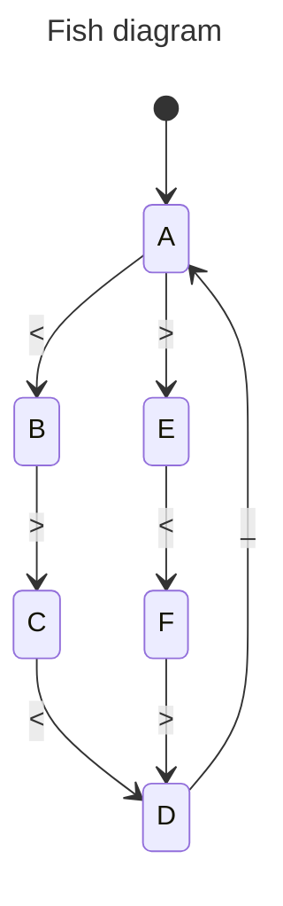

transition A,B,C and A,E,F make two possible fish patterns

```mermaid
---
title: Fish diagram
---
stateDiagram-v2
    [*] --> A
    A --> B : <
    B --> C : >
    C --> D : <
    D --> A : _
    A --> E : >
    E --> F : <
    F --> D : >
```
