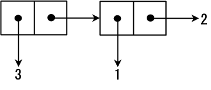

+ cons cells
+ cons function
+ car part: Contents of the Address part of the Register
+ cdr part: Contents of the Decrement part of the Register

+ These names also indicate that the reality of the cons cell is a memory space
+ The name cons is an abbreviation of a English term 'construction' for your information

```
(cons 1 2)
;Value 11: (1 . 2)
```


```
(cons 3 (cons 1 2))
;Value 15: (3 1 . 2)
```




```
(cons #\a (cons 3 "hello"))
(cons "abc" (cons 3 "hello"))
(cons (cons 0 1) (cons 2 3))
```

+ #\c represents a character c. For example, #\a represents a character a.

+ "Data structures which do not use cons cells are called atom"


