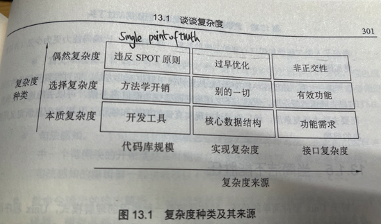

复杂度: 尽可能简单, 但别简单过了头
==========================================

+ 什么是"尽可能的简单"? 如何断定?

+ related: ./ch04-modularity.md

+ 复杂度的三个来源
    1. 实现的复杂度
    2. 程序界面的复杂度
    3. 系统中代码的总行数

+ Gabriel "Lisp: good news, bad news, and hot to win big"
    + unix和c语言具有病毒般的特性; 在软件设计发展过程的奋斗中, 哪些促成快速传播(传染)的特征, 如实现的简单性和可移植性, 比起设计的正确性和完备性更为有效
    + Gabriel的中心论点是关于 实现 和 接口 复杂度之间的一个精准权衡

+ 如果目标是抑制整体复杂度, 最愿意牺牲的是什么地方? 什么地方又最该被牺牲掉?

+ 对于本章(13.1.2)大多数问题, 良好品味和工程判断力要求, 情况不同, 则答案不同; 重要的是培养斟酌每一个设计的习惯. 正如我们在讨论软件模块性之前的建议一样, 复杂度的算盘一定要打好

+ 本质的/选择的/偶然的复杂度(13.1.3)

+ "仅10行程序, 再优雅也无法控制喷气飞机"(喷气飞机的复杂时必然的)

+ 为了看得更敏锐, 我们需要从注意 偶然复杂度 和 选择复杂度 的区别开始
    + 偶然复杂度的产生, 是因为没有找到实现规定功能集合的最简方法; 可以由良好的设计或者重新设计来去除
    + 选择复杂度, 通某个期望的功能相关联, 只能由改变工程的目标来去除

+ 这两者 好区分吗?

+ 复杂度的不同来源必须以不同的方式应对(p301)
    + 代码库规模可以采用更好的工具来解决
    + 实现复杂度可以选择更好的算法来处理
    + 接口复杂度必须着眼于更好的交互设计, 一种考虑了人类工程学和用户心理学在内的技能; 这种技能, 比编码能力更为少见(并可能更加困难)

+ 另一方面, 处理各种复杂度, 必然更仰赖于见识而非方法
    + 通过发现更简单的方法, 可以去除偶然复杂度
    + 依赖上下文环境判断哪些功能值得去做, 可以去除选择复杂度
    + 而要去除本质复杂度, 就只能通过对现实真谛的洞察和顿悟, 从根本上重新定义所要解决的问题

### 当简洁不能胜任时

+ unix程序员常常认为似乎所有可能复杂性都是偶然复杂性, 这种态度很容易产生, 本书的大部分内容就是为了防止这个的

+ 干净的简约主义让我们在多个层面上感觉良好, 为此设计也是非常有价值的防范措施, 能够防止软件系统表面光鲜但内里功能不足的自然趋势

+ **但是, 计算资源以及人类的思考, 同财富一样, 不是靠储藏而是靠消费来证明其价值的** 同其他没血性是一样, 我们需要注意何时设计上的简约已经不再是有价值的自律形式, 而开始成为一件伪装的苦行者外衣 --- 一种实际上把美德作为借口来敷衍工作的纵容方式

+ 少吃多干 还是 多吃多干, 一直是unix传统的主要冲突(p315)

## 13.4 软件的适当规模

+ "框架的存在" 如同鱼周围的水

+ 在旧学派的unix中, 唯一的框架就是管道/重定向/shell; 整合工作由脚本完成, 而共享上下文环境(本质上)就是文件系统本身; 但这并不是进化的终点

+ 最简原则暗示: **选择需要管理的上下文环境, 并且按照边界所允许的最小化方式构建程序**; 这就是 "尽可能简单, 而不过于简单", 集中关注选择共享上下文环境. 实际上, 这并不仅仅适用于框架, 也适用于应用和程序系统

+ 吝啬原则: 只有实证了其他方法行不通时才写庞大程序 --- 也就是 已经尝试过了分解问题但惨遭失败

+ 当编制一个框架时, 牢记分离原则; 框架是机制, 尽可能少地包含策略
+ 在多数情况下, 根本不需要什么策略. 尽可能多地将行为分解到使用框架的模块中期
+ 编制或重用框架的好处之一, 是能够有益于将"不这样做会是大块策略"的东西分离到独立的模块/模式/工具, 可以有效地同其他程序重新组合起来的部分中去

+ 这些准则是颇有价值和启发性的方法, 但是unix传统深处这种矛盾冲突, 并不能将任何给定的工程划分为和里的最佳规模, 并分而治之
+ 具体情况具体分析, 而锻炼良好的判断力和品味恰好是软件设计者所追求的.
+ 正如曹洞禅(???)所说, 形成才是摸底; 顿悟在每日的实践中

